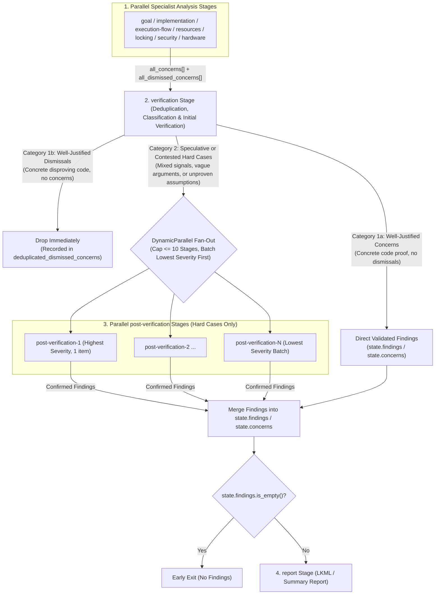

# Design: Consolidated Verification, Signal Classification, and Parallel Per-Finding Post-Verification

## 1. Objective and Problem Statement

### 1.1 Context
In Sashiko's multi-stage patch review pipeline (`src/workflows/linux_patch_review.rs` and `src/workflows/sashiko_patch_review.rs`), up to seven specialist analysis stages (`goal`, `implementation`, `execution-flow`, `resources`, `locking`, `security`, `hardware`) run in parallel and independently emit `concerns[]` and `dismissed_concerns[]`. Previously, these raw outputs were processed by three sequential consolidation stages before `report`:
1. `deduplication`: Merged duplicate concerns and duplicate dismissed concerns.
2. `conflict-resolution`: Checked whether any `dismissed_concern` disproved an existing `concern`.
3. `verification`: Verified all surviving concerns in a single monolithic tool-using LLM session and calibrated their severities.

### 1.2 Empirical Problems in the Previous Pipeline
Analysis of the 99-entry Linux kernel benchmark (`benchmarks/benchmark_small.json`) identified three structural weaknesses in the sequential `deduplication -> conflict-resolution -> verification` pipeline:

1. **Uncontested Speculative Dismissals (`dismissed_concerns[]` Blind Spot):**
   In at least 6 of the 37 missed benchmark cases (`b3749f174d68`, `94f418a20664`, `84c6d36bcaf9`, `c68cbbfd54c6`, `778b8ebe5192`, `2a5dc090b92c`), a specialist stage identified the exact ground-truth bug, talked itself out of it using an unverified assumption (e.g., assuming an unseen caller frees a leaked pointer on error, assuming `skb_queue_tail`'s internal spinlock substitutes for `lock_sock(sk)` against socket teardown, or assuming host and target bitness match), and recorded it *only* in `dismissed_concerns[]`. Because `conflict-resolution` only compared `dismissed_concerns` against existing `concerns`, standalone `dismissed_concerns` based on speculative or vague reasoning were never audited or promoted.
2. **Attention Dilution and Silent Drops in Monolithic `verification`:**
   When a review produces 5–15 candidate concerns, a single monolithic `verification` stage must investigate every candidate within one shared tool-turn budget and emit all validated findings in one JSON response. In practice, this caused the model to silently drop valid secondary findings (e.g., `2a5dc090b92c`) or compress `severity_explanation` to a single symptom (e.g., omitting `mremap` alongside `munmap` in `4ab5efcc2829` or omitting the NULL dereference alongside the memory leak in `6a2968aaf50c`), downgrading `DETECTED` results to `PARTIALLY_DETECTED`.
3. **Unnecessary Sequential Passes on Clear-Cut Concerns:**
   When multiple specialist stages independently identify the same defect with concrete code proof and no stage attempts to dismiss it, passing that concern through three separate sequential LLM stages (`deduplication`, `conflict-resolution`, and monolithic `verification`) adds latency and token overhead while risking accidental attrition.

### 1.3 Design Goals
1. **Unified `verification` Stage (Deduplication + Classification + Fast-Path Verification):** Combine deduplication, signal classification, and initial verification into a single `verification` stage that immediately finalizes well-justified concerns, immediately drops well-justified dismissals, and isolates speculative or contested "hard cases".
2. **Audit Speculative Dismissals:** Treat both `concerns` and `dismissed_concerns` symmetrically during classification so standalone `dismissed_concerns` relying on unproven assumptions or vague arguments are classified as `SpeculativeOrContested` and sent to `post-verification`.
3. **Parallel Per-Finding `post-verification` Stage:** Verify each `SpeculativeOrContested` hard case in its own isolated parallel stage with dedicated tool turns (`WorkflowStep::DynamicParallel`), preventing attention dilution and silent drops.
4. **Severity-Ordered Batching Above 10 Hard Cases:** Cap parallel `post-verification` stages at `10`, keeping the highest-severity candidates in dedicated 1-item stages and batching the lowest-severity candidates together.

---

## 2. Architecture Overview



---

## 3. Detailed Stage Design

### 3.1 Stage 1: `verification` (Deduplication, Classification & Initial Verification)

The `verification` stage serves as the `planner` of a `WorkflowStep::DynamicParallel` step. It receives `all_concerns`, `all_dismissed_concerns`, and `follow_up_series_context` (when reviewing a multi-patch series).

#### Responsibilities
0. **Entry Condition (Auditing Standalone Dismissed Concerns):**
   - The workflow only early-exits before `verification` when *both* `all_concerns.is_empty() && all_dismissed_concerns.is_empty()`. Previously, exiting whenever `all_concerns.is_empty()` bypassed consolidation entirely when a specialist stage placed a real bug only in `dismissed_concerns[]`.
1. **Deduplication & Grouping:**
   - Group `concerns` and `dismissed_concerns` that refer to the same underlying root cause and function/lifecycle phase.
   - Keep setup/registration bugs (`*_register_*` / `probe`) separate from teardown/unregistration bugs (`*_unregister_*` / `remove`), and keep distinct failure mechanisms in separate functions as separate items.
   - Preserve all distinct triggering conditions, syscalls, and racing callbacks across merged items (e.g., both `mremap` and `munmap` VMA duplication paths) and merge `locations[]`.
2. **Classification into Three Categories:**
   Every deduplicated item (whether originating from `concerns`, `dismissed_concerns`, or both) is classified using explicit evidence rules:
   - **Category 1a — Well-Justified Concern (`findings[]`):**
     - **Mandatory Prerequisite:** Concrete, self-contained code proof in `locations` / diff / prefetched context with **no** unverified assumptions about unseen code and **no** potential resolution by a follow-up patch in the series. Repetition without concrete code proof is never sufficient.
     - **Strong Signals:**
       - Multiple specialist stages independently raised the concern backed by concrete code proof and **no** stage attempted to dismiss it; OR
       - A single stage raised the concern with complete, self-contained code proof already visible in the diff/prefetched context/locations and **no** stage attempted to dismiss it.
     - **Action:** `verification` directly calibrates its severity (`Critical`, `High`, `Medium`, `Low`) according to `severity.md`, writes a comprehensive `severity_explanation`, sets `"preexisting": true/false`, and emits it into `findings[]`.
   - **Category 1b — Well-Justified Dismissal (`dismissed_concerns[]`):**
     - **Mandatory Prerequisite:** Concrete disproving `code_snippet` in `locations` (showing the exact lock, guard, bounds check, NULL check, cleanup path, or lifecycle invariant that prevents the bug) with **no** unverified assumptions about unseen callers, callees, hardware bounds, or configurations. Multiple stages repeating the same unverified dismissal assumption does NOT make a dismissal well-justified.
     - **Strong Signals:**
       - Multiple identical/overlapping dismissed concerns backed by concrete disproving code with **no** attempts to justify the issue as a concern; OR
       - A single dismissed concern backed by a concrete disproving `code_snippet` in `locations`, with **no** competing concern and **no** unverified assumptions about unseen code.
     - **Action:** Recorded in `dismissed_concerns[]` for observability and dropped from further verification.
   - **Category 2 — Speculative or Contested (`hard_cases[]`):**
     - **Strong Signals:**
       - **Mixed Signals:** Both one or more `concerns` and one or more `dismissed_concerns` address the same root cause, function, or code path.
       - **Speculative or Vague Concern (Single or Multiple):** One or more overlapping `concerns` whose argument is vague, relies on assumptions not backed by specific code in the diff/context (even if multiple stages repeated the same unproven concern), or may be resolved by a follow-up patch in `follow_up_series_context`.
       - **Speculative or Assumption-Based Dismissal (Single or Multiple):** One or more standalone `dismissed_concerns` (even when multiple stages repeated the same dismissal and no stage raised a matching `concern`) whose dismissal relies on assumptions not proven by the cited `code_snippet` (e.g., assuming an unseen caller frees a pointer on error, assuming an internal queue spinlock protects socket state against concurrent teardown, assuming configuration/architecture constraints without proof).
     - **Action:** Emitted into `hard_cases[]` for deep tool-assisted verification in `post-verification`.

#### `VerificationOutput` Schema
```json
{
  "findings": [
    {
      "problem": "Concise 1-sentence description of the bug",
      "severity": "Low | Medium | High | Critical",
      "severity_explanation": "Detailed explanation of impact and exploitability/triggerability",
      "preexisting": false,
      "locations": [
        {
          "file": "path/to/file.c",
          "function_or_symbol": "func_name",
          "line": 123,
          "code_snippet": "exact code snippet",
          "why_this_location_matters": "role in bug"
        }
      ]
    }
  ],
  "hard_cases": [
    {
      "type": "Category of the candidate defect",
      "description": "Detailed description of the candidate bug and failure mechanism",
      "estimated_severity": "Low | Medium | High | Critical",
      "signal_reason": "mixed_signals | speculative_concern | speculative_dismissal | series_interaction",
      "concern_arguments": "Consolidated reasoning supporting the bug (or candidate bug identified before dismissal)",
      "dismissal_arguments": "Consolidated reasoning claiming the code is safe (if any)",
      "verification_question": "Exact code question that post-verification must answer using Git/file tools",
      "preexisting": false,
      "locations": [
        {
          "file": "path/to/file.c",
          "function_or_symbol": "func_name",
          "line": 123,
          "code_snippet": "exact code snippet",
          "why_this_location_matters": "role in bug"
        }
      ]
    }
  ],
  "dismissed_concerns": [
    {
      "type": "Category of the disproved concern",
      "description": "What was investigated",
      "reasoning": "Concrete proof why it is not a bug",
      "locations": [...]
    }
  ]
}
```

#### State Reduction after `verification`
- Validated items in `output.findings` with `preexisting == false` are pushed to `state.findings`.
- Validated items in `output.findings` with `preexisting == true` are converted and pushed to `state.concerns` (for the standalone pre-existing bug pipeline).
- `output.dismissed_concerns` are stored in `state.deduplicated_dismissed_concerns`.
- `output.hard_cases` are stored in `state.hard_cases` (`Vec<Value>`) to drive the `DynamicParallel` resolver for `post-verification`.

---

### 3.2 Stage 2: `post-verification` (Parallel Per-Finding Verification for Hard Cases)

#### Dynamic Fan-Out and Severity-Ordered Batching (`MAX_POST_VERIFICATION_STAGES = 10`)
When the `DynamicParallel` resolver (`resolve_post_verification_stages_with_options`) runs after `verification`:
1. If `state.hard_cases` is empty, `batch_hard_cases_by_severity` returns an empty `Vec`, skipping `post-verification` completely with zero LLM calls.
2. Otherwise, `state.hard_cases` is sorted by `estimated_severity` descending (`Critical` > `High` > `Medium` > `Low`), preserving relative order within each severity tier.
3. Let $N = \text{hard\_cases.len()}$ and $M = 10$ (`MAX_POST_VERIFICATION_STAGES`):
   - **When $N \le 10$:** Each hard case is assigned to its own 1-item batch, producing $N$ parallel `post-verification` stages (`post-verification-1` .. `post-verification-N`).
   - **When $N > 10$:** Let $\text{extra} = N - 10$, $\text{tail\_stages} = \min(\text{extra}, 10)$, and $\text{solo\_stages} = 10 - \text{tail\_stages}$:
     - The first $\text{solo\_stages}$ highest-severity items each receive a dedicated 1-item parallel stage.
     - The remaining $N - \text{solo\_stages}$ lowest-severity items are partitioned evenly across the last $\text{tail\_stages}$ stages (`base_size = rem_len / tail_stages`, with the last `rem_len % tail_stages` stages receiving one extra item).
     - **Example ($N = 12$):** `extra = 2`, `tail_stages = 2`, `solo_stages = 8`, batch sizes = `[1, 1, 1, 1, 1, 1, 1, 1, 2, 2]`. The 8 highest-severity hard cases each get a dedicated 1-item parallel stage (`post-verification-1` .. `post-verification-8`), while the 4 lowest-severity hard cases are paired into 2 batches of 2 (`post-verification-9`, `post-verification-10`).

```rust
pub const MAX_POST_VERIFICATION_STAGES: usize = 10;

pub static POST_VERIFICATION_STAGE_NAMES: [&str; MAX_POST_VERIFICATION_STAGES] = [
    "post-verification-1",
    "post-verification-2",
    "post-verification-3",
    "post-verification-4",
    "post-verification-5",
    "post-verification-6",
    "post-verification-7",
    "post-verification-8",
    "post-verification-9",
    "post-verification-10",
];
```

#### Per-Batch Execution & Prompt Design
- **Tool Scope:** `ToolScope::All` (`git_read_files`, `git_grep`, `git_diff`, `git_show`, `git_blame`), `wants_series_context: true`.
- **Included Guides:** `false-positive-guide.md`, `severity.md`.
- **Minimal, Focused Input:** Each `post-verification-K` stage receives *only* its assigned hard case (or small batch of low-severity hard cases), including:
  - `concern_arguments` and `dismissal_arguments`
  - `signal_reason` and `verification_question`
  - `locations`
  - `follow_up_series_context` (if any)
- **Verification Directives:**
  1. Use Git/file tools to inspect the exact functions, callers, callees, lock contexts, struct definitions, or follow-up series commits needed to answer `verification_question`.
  2. Apply a strict **Symmetrical Proof Bar**: neither `concern_arguments` nor `dismissal_arguments` is trusted without code proof. Do not dismiss a candidate bug unless concrete code in the repository proves the exact failure path cannot occur. Conversely, if a standalone speculative dismissal is disproved by the code (i.e. the bug is real and the dismissal's assumption was false), promote it to a verified finding.
  3. Preserve all distinct failure mechanisms and consequences (e.g., both `mremap` and `munmap` VMA duplication, or both a NULL pointer dereference and a memory leak) in `severity_explanation`.
  4. Output `{"findings": [...], "dismissed_concerns": [...]}` accounting for every candidate in the batch (never returning both empty arrays, and requiring a concrete disproving `code_snippet` in `dismissed_concerns[].locations` whenever a candidate is disproved).

#### State Reduction after `post-verification`
Each parallel `post-verification-K` stage reduces its `PostVerificationOutput` (`{"findings": Vec<Value>, "dismissed_concerns": Vec<Value>}`) sequentially into `LinuxPatchReviewState`:
- Items in `findings` with `preexisting == false` are appended to `state.findings` via `record_verified_findings`.
- Items in `findings` with `preexisting == true` are appended to `state.concerns` via `record_verified_findings`.
- Items in `dismissed_concerns` are appended to `state.deduplicated_dismissed_concerns` so disproved hard cases are preserved in the review's exported `dismissed_concerns` output.

---

### 3.3 Progress Display & Stage Registry Integration

1. **`CONSOLIDATION_STAGES` Table (`src/workflows/linux_patch_review.rs` & `src/workflows/sashiko_patch_review.rs`):**
   - `CONSOLIDATION_STAGES` is updated from `[deduplication, conflict-resolution, verification, report]` to `[verification, post-verification, report]` (and `[verification, post-verification, report, summary]` for Sashiko).
   - `stage_short_label(name)` maps `"verification"` to `"Verification"`, `"post-verification"` and `"post-verification-1"`..`"post-verification-10"` to `"Post-Verification"`, and `"report"` to `"Report Generation"`.
   - `is_known_stage(name)` recognizes `"verification"`, `"post-verification"`, `"post-verification-1"`..`"post-verification-10"`, and `"report"`.
2. **`WorkflowEvent::ParallelResolved` Handling (`src/worker/prompts.rs` & `src/workflows/mod.rs`):**
   - On the initial analysis fan-out, `planned_stages_from(project, &stage_names)` emits the initial stage plan with `"post-verification"` as a single placeholder.
   - On the second `DynamicParallel` resolution (after `verification`), `refine_planned_stages_with_post_verification` replaces the `"post-verification"` placeholder with the concrete `0..=10` resolved `post-verification-*` stages so the CLI progress denominator stays exact.

---

## 4. Implementation & Benchmark Validation

1. **State, Schemas, and Batching Helpers (`src/workflows/linux_patch_review.rs`):**
   - Added `hard_cases: Vec<Value>` to `LinuxPatchReviewState`, required `hard_cases` / `dismissed_concerns` fields to `VerificationOutput`, and a dedicated `PostVerificationOutput` (`findings: Vec<Value>`, `dismissed_concerns: Vec<Value>`) for `post-verification`.
   - Implemented `batch_hard_cases_by_severity`, `validate_verification_stage_output`, and `validate_post_verification_output` with unit tests covering $N = 0$, $N \le 10$, $10 < N \le 20$, and $N > 20$.
2. **Unified `verification_stage` and Parallel `post_verification_stage_for_batch` (`src/workflows/linux_patch_review.rs` & `src/workflows/sashiko_patch_review.rs`):**
   - Replaced `deduplication_stage` + `conflict_resolution_stage` + monolithic `verification_stage` with unified `verification_stage` and `DynamicParallel` `post-verification` fan-out, propagating stage and prompt provenance across all consolidation stages.
3. **99-Entry Benchmark Evaluation (`benchmarks/benchmark_small.json`):**
   - **Detected (Exact):** **61 / 97 reviewed entries (62.9%)**, up `+7` from **54 / 97 (55.7%)** in the 3-stage sequential baseline.
   - **Partially Detected:** **6 / 97 (6.2%)**.
   - **Total Detected + Partial:** **67 / 97 reviewed entries (69.1%)**, up `+7` from **60 / 97 (61.9%)**, with **30 Missed** (down from 37) and **2 Not Reviewed** (merge/skipped commits).
   - **Final Findings (Signal-to-Noise):** **326 total findings** (`3.36` findings/patch), compared to `333` (`3.43` findings/patch) in the baseline (`-7` fewer findings while detecting `+7` more ground-truth bugs).
4. **Full 999-Entry Benchmark Evaluation (`benchmarks/benchmark.json`):**
   - **Detected (Exact):** **467 / 986 reviewed entries (47.4%)**, up `+13` from **454 / 987 (46.0%)** in the baseline.
   - **Partially Detected:** **61 / 986 (6.2%)**, up `+3` from **58 / 987 (5.9%)**.
   - **Total Detected + Partial:** **528 / 986 reviewed entries (53.5%)**, up `+16` from **512 / 987 (51.9%)**, with **458 Missed** (down `-17` from 475).
   - **Final Findings (Signal-to-Noise):** **3,889 total findings** (`3.94` findings/patch), down **`-275` (`-6.6%`)** from **4,164 total findings** (`4.22` findings/patch) in the baseline.
   - **Fast-Path & Parallel Fan-Out Behavior:** Across 882 completed patch reviews on the 999-entry suite, `verification` finalized **2,445 direct findings** (Category 1a, `62.9%` of all final findings), dropped **2,880 well-justified dismissals** (Category 1b), and routed **1,366 hard cases** (Category 2, avg `1.55`/review) to parallel `post-verification`, skipping `post-verification` entirely in **33.4% (295/882)** of reviews. Parallel `post-verification` validated **1,444 findings** (`37.1%` of all final findings) and disproved **353 hard cases** with concrete code snippets.
